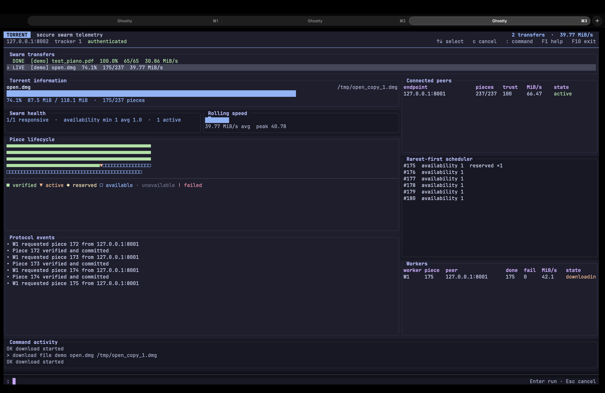
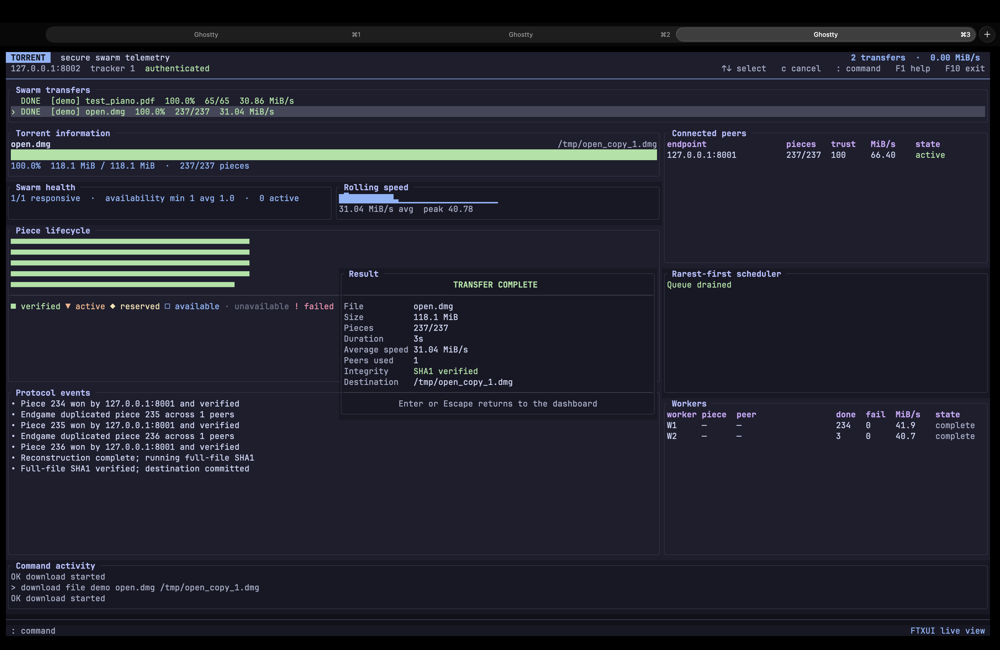

# Torrent Atlas

Torrent Atlas is a terminal-based, two-tracker distributed file sharing system. It separates
metadata coordination from file transfer: trackers manage users, groups, sessions, and seeder
advertisements, while clients exchange file pieces directly with one another.

The project is built around three goals:

- practical peer-to-peer file sharing with direct client-to-client transfers;
- a responsive terminal dashboard for live swarm visibility and control;
- a security model that treats peer traffic as an authenticated, encrypted channel.

## Screenshots

During an active transfer:



After completion:



## Features

- Two independent trackers with in-memory metadata replication and failover.
- Direct client-to-client piece transfer with signed ephemeral handshakes.
- Piece-level scheduling with rare-piece prioritization and endgame duplication.
- Resume support with durable `.part` and `.resume` files.
- Live telemetry for progress, availability, throughput, peer trust, and protocol events.
- Command-line mode and an FTXUI-based interactive TUI.
- Password verification, session handling, and peer identity keys backed by OpenSSL.

## Repository Layout

```text
.
├── client/              # Client implementation, storage, telemetry, and TUI model
├── common/              # Shared protocol, crypto, parsing, and hashing utilities
├── images/              # README screenshots
├── tests/               # Unit and integration tests
├── tracker/             # Tracker implementations and shared tracker state
├── CMakeLists.txt       # Primary build
├── Makefile             # Classic build and test targets
├── README.md            # This file
├── SECURITY.md         # Protocol and threat-model notes
└── TECHNICAL_REPORT.md  # Design rationale and implementation details
```

Build outputs are written to `build/` for CMake or `bin/` for the classic Makefile.

## Requirements

- Linux or macOS
- C++17 compiler
- CMake 3.16 or newer
- POSIX sockets and pthread support
- `pkg-config`
- OpenSSL 3.x
- Git
- Network access during the initial FTXUI fetch

On Debian or Ubuntu:

```sh
sudo apt install g++ cmake make git pkg-config libssl-dev
```

## Build

Recommended build:

```sh
cmake -S . -B build -DCMAKE_BUILD_TYPE=Release
cmake --build build -j
```

Classic Makefile build:

```sh
make
```

## Test

Run the full CTest suite:

```sh
ctest --test-dir build --output-on-failure
```

Run the Makefile-specific checks:

```sh
make security-test
make tracker-state-test
make command-parser-test
```

## Run The System

Create `tracker_info.txt` with exactly two tracker endpoints:

```text
127.0.0.1:6000
127.0.0.1:7000
```

Start the two trackers:

```sh
./build/tracker tracker_info.txt 1
./build/tracker tracker_info.txt 2
```

Compatibility binaries are also available:

```sh
./build/tracker1 tracker_info.txt 1
./build/tracker2 tracker_info.txt 2
```

Start one client per peer endpoint:

```sh
./build/client 127.0.0.1:8001 tracker_info.txt
./build/client 127.0.0.1:8002 tracker_info.txt
```

Launch the TUI version with:

```sh
./build/client 127.0.0.1:8001 tracker_info.txt --tui
```

The classic Makefile build uses the same command shape, but the binary is in `bin/`:

```sh
./bin/client 127.0.0.1:8001 tracker_info.txt
```

## Client Commands

Spaced commands and underscore variants are both accepted.

```text
create user <user-id> <password>
login <user-id> <password>
create group <group-id>
join group <group-id>
leave group <group-id>
list groups
list requests <group-id>
accept request <group-id> <user-id>
upload file <group-id> <file-path>
list files <group-id>
download file <group-id> <file-name> <destination-path>
resume download <group-id> <file-name> <destination-path>
cancel download <file-name>
show downloads
stats
peer_stats
show peers
stop share <group-id> <file-name>
logout
quit
```

Examples with quoted paths:

```text
upload file demo "documents/final report.pdf"
download file demo "final report.pdf" "/tmp/final report.pdf"
```

## Workflow

1. Create a user and log in on the seeder client.
2. Create a group and upload a file.
3. On the downloader client, create a user, log in, and join the group.
4. Accept the request on the seeder client.
5. Start the download and watch the live telemetry in `stats` or the TUI.
6. Verify the result with `cmp`, `sha1sum`, or `shasum`.

## Security Model

The peer protocol uses:

- Ed25519 signatures for persistent client identities;
- X25519 for ephemeral key agreement;
- HKDF-SHA256 for transcript-bound session keys;
- ChaCha20-Poly1305 for authenticated encryption;
- timestamp and nonce checks to reject replay.

Tracker passwords are stored as salted PBKDF2-HMAC-SHA256 verifiers. Client identity keys
persist in a restricted local directory by default under `~/.torrent-dashboard/identities`.

For the deeper security notes, see [SECURITY.md](SECURITY.md).

## Architecture

- Trackers keep users, sessions, groups, files, and seeders in memory.
- Clients keep completed downloads, partial downloads, resume manifests, and peer reputation.
- Piece requests are scheduled by rarity first, then by live reputation and throughput.
- Verified pieces are written immediately, exposed to the swarm, and revalidated on resume.
- The final file is committed only after a full-file SHA1 check succeeds.

## Testing Notes

The repository includes unit and integration coverage for:

- cryptographic primitives and peer identity persistence;
- command parsing;
- tracker state behavior;
- tracker-to-tracker replication and restart recovery;
- full client-to-client download flow.

The best end-to-end check is the integration test plus a manual transfer between two clients.

## Documentation

- [TECHNICAL_REPORT.md](TECHNICAL_REPORT.md) for design rationale and protocol details.
- [SECURITY.md](SECURITY.md) for the threat model and cryptographic choices.
- `design.pdf` for the original specification the project implements.

## Notes

- User IDs and group IDs must not contain whitespace.
- File paths may be quoted or backslash-escaped.
- Tracker metadata is ephemeral and clears when both trackers stop.
- Resume manifests include file capabilities and are written with restrictive permissions.
